---
hide:
  - toc
---

# Screenshots

A visual tour of every page in Prism. Captured against a fresh seed (the synthetic Alex / Jordan / Emma / Sophie family) — your own dashboard will look different.

## Dashboard

-   **Light mode**

    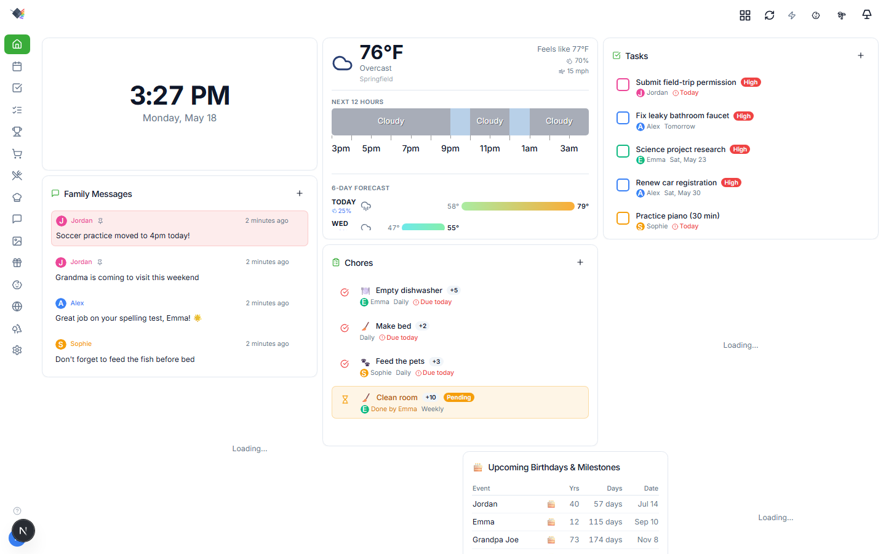

-   **Dark mode**

    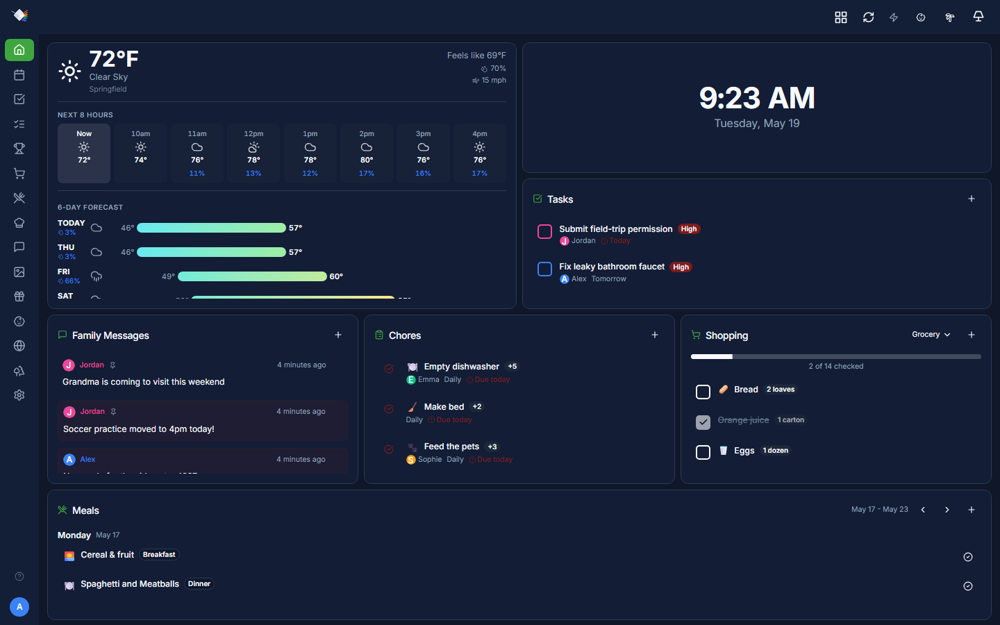

-   **Mobile (PWA)**

    { width="300" }

## Calendar

-   **Month view**

    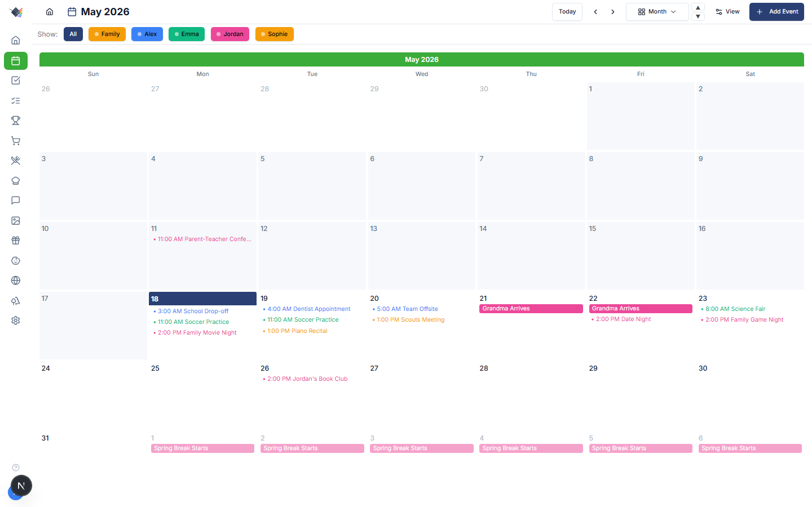

-   **Multi-week view (2 weeks)**

    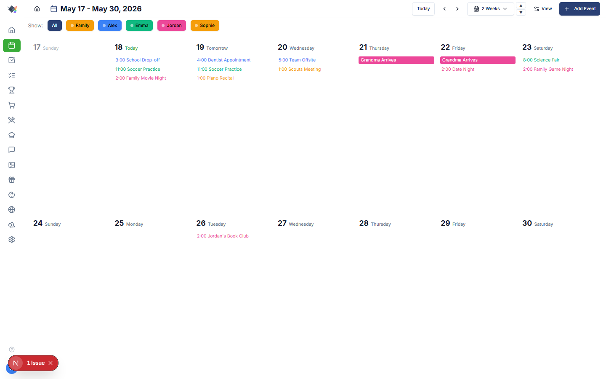

-   **Schedule view (single week, hourly)**

    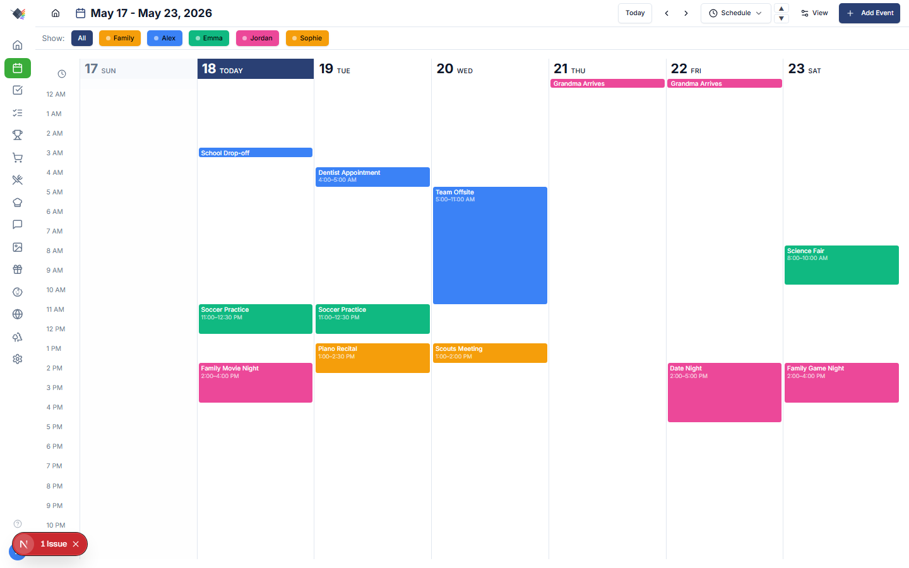

-   **Day view (side-by-side per person)**

    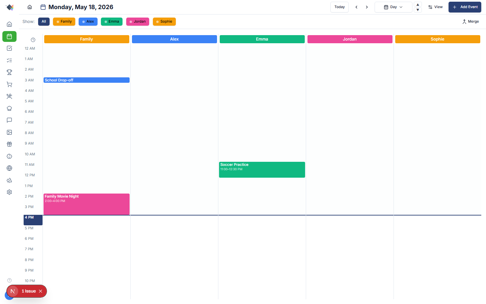

-   **Agenda view (chronological list)**

    

-   **Mobile (agenda-only)**

    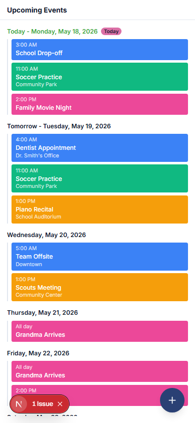{ width="300" }

## Shopping

-   **Grocery list with categories**

    

-   **Mobile shopping**

    { width="300" }

## Recipes

## Meals

## Tasks

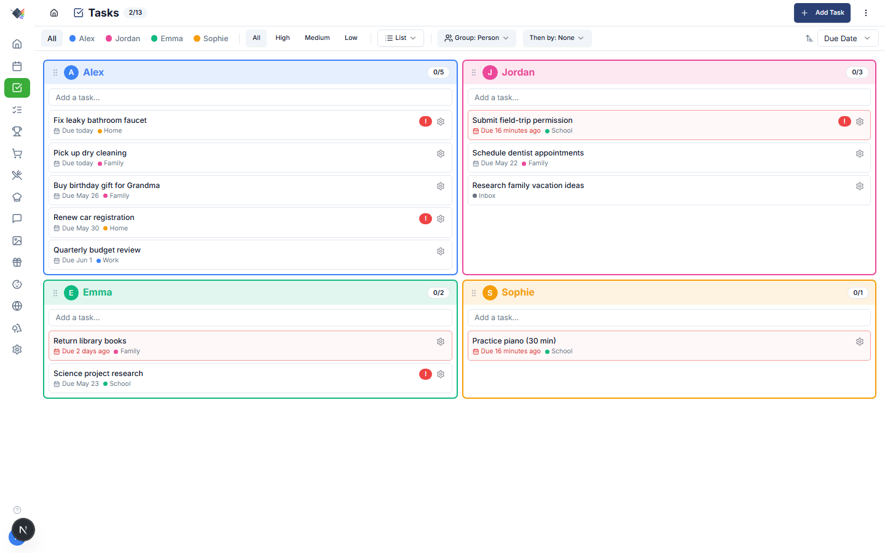

## Chores

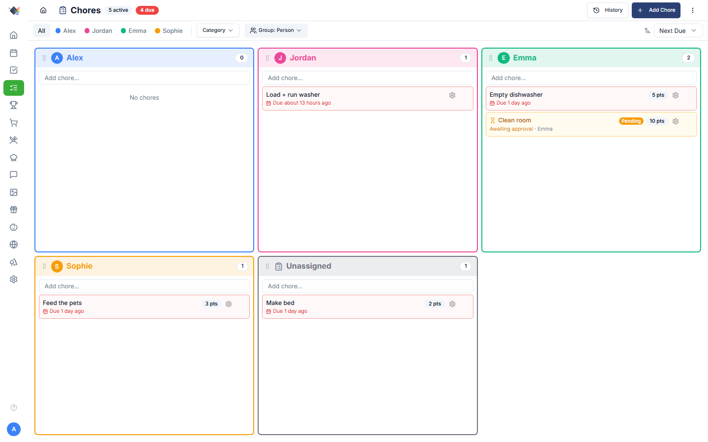

## Goals & Points

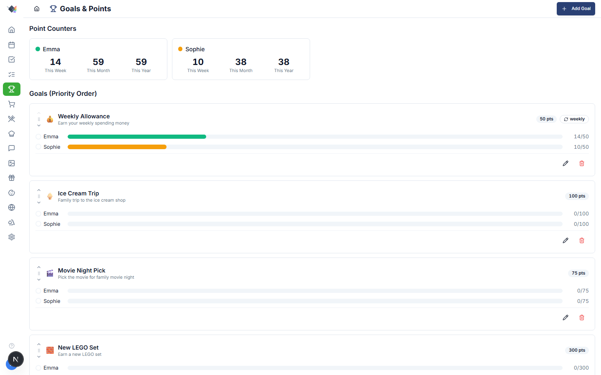

## Wishes & Gift Ideas

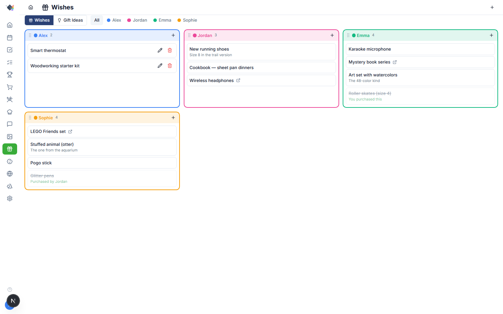

## Photos

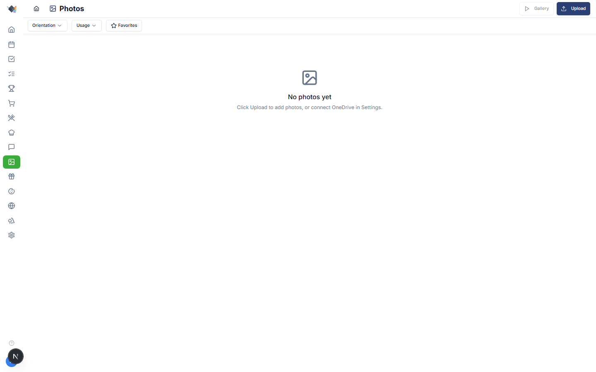

## Travel Map

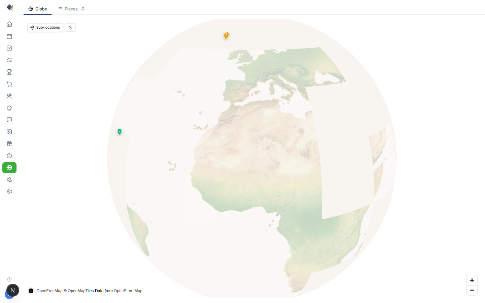

## Weekend Ideas

## Messages

